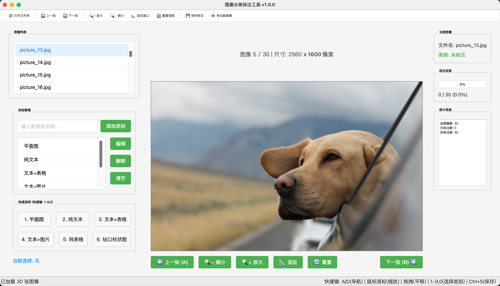

# 图像分类标注工具（ImageClassifierAnno）

一个基于 PyQt6 的本地图像分类标注工具，支持多类别管理、快捷键标注、数据集导出等功能，适用于小型或中型图像分类数据集的快速标注和整理。



## 功能特性

- 支持多种常见图像格式（jpg, png, bmp, tiff, webp 等）
- 可自定义类别，支持类别的添加、编辑、删除和清空
- 快捷键（数字键 1-9,0）快速切换类别
- 图像浏览、缩放、拖拽、适应窗口等操作
- 标注数据自动保存，防止丢失
- 支持数据集一键导出（按类别分文件夹，自动划分训练/验证集）
- 导出数据集包含类别索引和数据集信息文件
- 直观的统计信息展示
- 现代化美观界面

## 安装方法

1. **环境要求**：
   - Python >= 3.10
   - 推荐使用虚拟环境

2. **依赖安装**：


使用 `pyproject.toml` 进行依赖管理：

```bash
pip install uv
uv sync
```

## 使用说明

1. 运行主程序：

```bash
uv run main.py
```

2. 打开包含图片的文件夹，左侧可浏览所有图片
3. 右侧可管理类别，支持添加、编辑、删除类别
4. 选中图片后，点击类别或使用数字键（1-9,0）进行标注
5. 支持图片缩放、拖拽、适应窗口等操作
6. 标注数据自动保存于 `data/annotations.json`
7. 可通过工具栏导出数据集，自动划分训练/验证集

## 目录结构

```
ImageClassifierAnno/
├── config.py                # 配置文件
├── main.py                  # 程序主入口
├── pyproject.toml           # 依赖与项目描述
├── README.md                # 项目说明
├── ui/
│   ├── category_manager.py  # 类别管理界面
│   ├── image_viewer.py      # 图片查看与交互
│   ├── main_window.py       # 主窗口
│   └── styles.py            # 界面样式
├── utils/
│   ├── dataset_exporter.py  # 数据集导出工具
│   └── file_utils.py        # 文件与标注工具
└── uv.lock                  # 依赖锁定文件
```

## 依赖列表

- pyqt6
- pillow
- opencv-python
- numpy
- json5

详见 `pyproject.toml`。

## 标注数据格式

标注数据默认保存在 `data/annotations.json`，格式如下：

```json
{
  "categories": ["类别1", "类别2", ...],
  "annotations": {
    "图片路径1": {"category": "类别1"},
    "图片路径2": {"category": "类别2"},
    ...
  },
  "version": "1.0"
}
```

## 数据集导出

- 导出后目录结构如下：

```
output_dir/
├── train/
│   ├── 类别1/
│   └── 类别2/
├── val/
│   ├── 类别1/
│   └── 类别2/
├── dataset_info.json
└── class_indices.json
```

- `dataset_info.json` 包含类别、图片数量、划分比例等信息
- `class_indices.json` 为类别到索引的映射

## 快捷键说明

- A/D：上一张/下一张图片
- 鼠标滚轮：缩放图片
- 拖拽图片：平移
- 1-9,0：选择类别
- Ctrl+S：保存标注

## 许可证

MIT License

---

如有建议或问题，欢迎 issue 或 PR！
